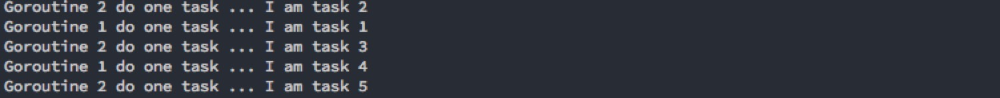

### TaskDiapatcher

#### Introduction
It's a simple golang taskdispatcher for limiting goroutines nums of running tasks.

#### Usage
Your task only needs implments of Run() function.
```go
type task1 struct {}
func (t *task1) Run() {fmt.Println("I am task 1")}
type task2 struct {}
func (t *task2) Run() {fmt.Println("I am task 2")}
type task3 struct {}
func (t *task3) Run() {fmt.Println("I am task 3")}
type task4 struct {}
func (t *task4) Run() {fmt.Println("I am task 4")}
type task5 struct {}
func (t *task5) Run() {fmt.Println("I am task 5")}

func main() {
    TaskDiaparcher.NewTask(2)  // 2 is the limit of goroutine nums
    TaskDiaparcher.AddTasks(new(task1),new(task2),new(task3),new(task4),new(task5)).Run()
}
```
output:



See full demo in Examples thanks.